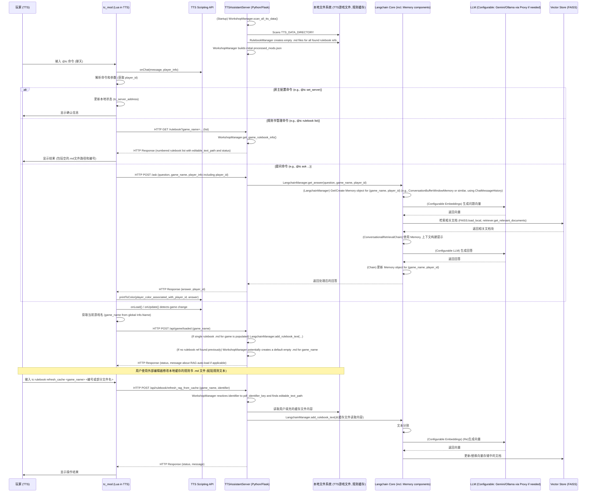

# TabletopSimulatorCompanion (TC) - 项目设计与实现文档

**版本**: 0.3.4
**最后更新**: 2025-05-31

## 1. 引言

TabletopSimulatorCompanion (TC) 是一个为桌游模拟器 (Tabletop Simulator, TTS) 设计的辅助工具 Mod，通过集成大型语言模型 (LLM) 提供即时游戏规则解释和问答，提升游戏体验。

**核心理念**:
*   **轻量级 Mod**: TTS Mod (`tc_mod`) 负责用户交互和与后端通信。
*   **本地服务端**: Python 服务端 (`TTSAssistantServer`) 处理核心逻辑 (LLM, RAG, 规则管理, **多玩家会话管理**)。
*   **聊天驱动**: 通过 TTS 聊天窗口交互。
*   **Langchain 集成**: 利用 Langchain简化LLM应用开发（包括**对话记忆**）。
*   **用户驱动规则内容**: 服务端创建空的规则书 `.md` 缓存文件，用户手动填充内容，通过 API 更新 RAG 索引。

## 2. 系统架构

TC 由 TTS Mod (`tc_mod`) 和 Python 服务端 (`TTSAssistantServer`) 组成。



### 2.1 TTS Mod (`tc_mod`)

*   **语言**: Lua。
*   **`tc_server_address` 默认值**: `"http://localhost:5678"`。
*   **职责**:
    *   **初始化 (`onLoad`)**: 加载配置 (若无则使用默认服务器地址), 获取当前游戏名 (直接从全局 `Info.Name`), 通知服务端游戏加载 (`/api/game/loaded`)。
    *   **聊天监听 (`onChat`)**: 解析 `@tc` (提问) 和 `tc` (指令) 命令。**提取提问玩家的 `player_id` (例如 `player.color` 或 `player.steam_id`)**。
    *   **命令转发**:
        *   配置: `tc set_server`, `tc debug_mode`, `tc reset_session [player_id|all]` (用于重置特定玩家或所有玩家的会话记忆)。
        *   规则书: `tc rulebook list` (获取带编号的 `.md` 文件列表), `tc rulebook refresh_cache <game_name> <编号或部分文件名>` (从用户填充的 `.md` 更新RAG)。
        *   提问: `@tc <question>` - **请求中包含 `player_id`**。
    *   **HTTP 通信**: 与服务端 JSON API 交互。
    *   **响应处理**:
        *   对于 `/ask` 的响应，**根据响应中返回的 `player_id`，使用 `printToColor()` 或类似函数将答案仅显示给提问的玩家**。
    *   **状态持久化**: `self.script_state` (服务器地址)。

### 2.2 Python 服务端 (`TTSAssistantServer`)

*   **框架**: Flask。
*   **启动时任务**:
    *   `WorkshopManager` 扫描 `cfg.TTS_DATA_DIRECTORY` (Mods 和 Saves 目录)，解析所有游戏/Mod的JSON文件，识别所有潜在的规则书引用。
    *   对每个发现的规则书引用，调用 `RulebookManager` 创建对应游戏名下的、空的、标准命名的（如 `rulebook_<original_pdf_name_slugified>.md`） `.md` 文件（如果尚不存在）。
    *   构建初始的 `processed_mods.json` 包含所有游戏的元数据。
*   **职责**:
    *   **API 接口 (`app.py`)**:
        *   `/ask`: 处理提问。请求体包含 `player_id`。**响应体中包含 `answer` 和原始的 `player_id`**。
        *   `/rulebook`: 列出规则书（带编号的 `.md` 文件路径及状态）。
        *   `/session/reset`: 重置会话。请求体中可包含 `player_id`，用于重置特定玩家的会话记忆；如果无 `player_id`，则清除与 `game_name` 相关的所有会话记忆和 RAG 状态。
        *   `/api/game/loaded`: 接收游戏加载通知。
            *   检查 `processed_mods.json` 中该 `game_name` 的规则书。
            *   如果该游戏只有一个 `.md` 文件且其内容非空（通过哈希或大小检查），则自动调用 `LangchainManager.add_rulebook_text` 为其构建RAG索引。
            *   如果之前扫描未发现此 `game_name` 的任何规则书引用，则为其创建一个默认的空 `rulebook_default_for_<game_name_slugified>.md` 文件并更新 `processed_mods.json`。
        *   `/api/rulebook/refresh_rag_from_cache`: 根据编号或部分文件名找到对应的 `.md` 文件，从用户填充的内容重建RAG索引。
    *   **配置管理 (`config.py`)**:
        *   从 `.env` 加载：LLM/Embedding 服务配置, `TTS_DATA_DIRECTORY`, `EDITABLE_RULEBOOK_TEXT_CACHE_DIRECTORY`, `VECTOR_STORE_DIRECTORY`。
        *   **代理配置**: `HTTP_PROXY` 和 `HTTPS_PROXY` 环境变量。如果设置了这些，则在创建外部 HTTP 请求（例如访问 Gemini API）的客户端时应用它们。Langchain 的 HTTP 客户端库通常会自动遵循这些标准环境变量。
    *   **规则书元数据与缓存文件准备 (`services/rulebook_manager.py`)**:
        *   `RulebookManager`: 负责为规则书条目创建空的、标准命名的 `.md` 缓存文件（如 `rulebook_<original_pdf_name_slugified_or_alias>.md`），确保不覆盖已存在且可能已填充内容的文件。
    *   **Workshop 扫描与规则书元数据管理 (`services/workshop_manager.py`)**:
        *   `WorkshopManager`:
            *   **启动时扫描所有数据**：`scan_all_tts_data()`。
            *   解析游戏/Mod JSON 文件，查找规则书引用。
            *   对每个发现的引用（或为无引用的游戏创建默认条目），调用 `RulebookManager` 创建空 `.md` 文件（如果不存在）。
            *   管理 `processed_mods.json`，记录规则书元数据 (来源, 标准化 `.md` 文件名和路径, 状态, 编号/别名)。
            *   提供按编号或部分文件名解析到 `pdf_identifier_key` 和 `editable_text_path` 的功能。
    *   **RAG 与 LLM (`services/langchain_manager.py`)**:
        *   `LangchainManager`:
            *   初始化 LLM/Embedding 并考虑代理。
            *   **会话管理**:
                *   内部维护一个字典（例如 `game_sessions`），以 `game_name` 为一级键，`player_id` 为二级键，存储每个玩家的 Langchain **对话记忆对象**。
                *   该对话记忆对象（例如，使用 `ChatMessageHistory` 实现底层存储，并可能由如 `ConversationBufferWindowMemory` 概念的类封装，以保留最近 `k` 轮对话）将为每个玩家会话隔离。
                *   `get_answer` 方法中，根据传入的 `game_name` 和 `player_id` 获取或创建对应的对话记忆对象。
                *   将此对话记忆对象传递给 `ConversationalRetrievalChain`。链会自动使用和更新这个记忆对象。
            *   `reset_conversation(game_name, player_id)`: 清除特定玩家的对话记忆对象。
            *   `clear_game_state(game_name)`: 清除与该游戏相关的所有对话记忆对象和 RAG 索引。
            *   其他功能（加载 `.md`，分割，向量化，FAISS，问答链）同前。

## 3. 核心功能实现细节

### 3.1 规则书管理流程

1.  **服务端启动 (Server)**:
    *   `WorkshopManager` 扫描整个 `TTS_DATA_DIRECTORY`，为所有游戏中发现的规则书引用创建对应的空 `.md` 文件 (如果尚不存在，且文件名标准化，如 `rulebook_rules.md`)，并记录到 `processed_mods.json`。
2.  **游戏加载 (Mod)**:
    *   `onLoad` 时，Mod 获取当前游戏名 (`Info.Name`) 并发送给服务端 `/api/game/loaded`。
3.  **服务端处理游戏加载 (Server)**:
    *   服务器检查 `processed_mods.json` 中此 `game_name` 的条目。
    *   如果此游戏只有一个关联的 `.md` 文件，且该文件内容非空（例如，通过检查文件大小或预存的哈希值），则服务器自动调用 `LangchainManager` 为此规则书构建/加载 RAG 索引。并在响应中告知 Mod RAG 已自动准备好。
    *   如果在启动扫描时未找到此 `game_name` 的任何规则书条目，服务器会为其创建一个默认的空 `.md` 文件 (e.g., `rulebook_default_for_<game_name_slugified>.md`) 并更新 `processed_mods.json`，提示用户可以填充此文件。
4.  **用户获取待编辑列表 (Mod & Server)**:
    *   玩家输入 `tc rulebook list`。
    *   Mod 请求服务端 `/rulebook?game_name=...`。
    *   服务端返回 `processed_mods.json` 中该游戏的规则书列表，**显示编号、规则书名（或原始文件名）、状态和完整的 `.md` 文件路径**。
5.  **用户手动填充规则 (User)**: 用户找到对应的 `.md` 文件，手动粘贴规则文本内容并保存。
6.  **触发RAG索引刷新 (Mod & Server)**:
    *   玩家输入 `tc rulebook refresh_cache <game_name> <编号或部分文件名>`。
    *   Mod 请求服务端 `/api/rulebook/refresh_rag_from_cache`。
    *   服务端 `WorkshopManager` 根据编号或部分文件名解析出目标 `.md` 文件的 `editable_text_path`。
    *   服务端 `LangchainManager` 读取此 `.md` 文件内容，分割、向量化，更新FAISS索引。
    *   `WorkshopManager` 更新 `processed_mods.json` 中该规则书状态 (e.g., `processed_into_rag`)。

### 3.2 LLM 支持、RAG 系统及对话管理

*   LLM 和 Embedding 模型通过 `config.py` 配置，支持多种 Langchain 兼容服务。代理设置通过环境变量应用于对这些服务的 HTTP 请求。
*   `LangchainManager`:
    *   使用 `TextLoader` 加载 `.md` 内容。
    *   使用 `RecursiveCharacterTextSplitter` 分割文本。
    *   使用 FAISS 存储和检索向量。
    *   **为每个 `(game_name, player_id)` 组合实例化并使用独立的 Langchain 对话记忆对象（例如，基于 `ChatMessageHistory` 并具备窗口缓冲功能），并将其整合到 `ConversationalRetrievalChain` 中，以实现多轮对话的上下文理解。**
    *   `ConversationalRetrievalChain` 负责协调提问、检索、生成答案和更新对话历史。

## 4. 安装与使用指南

参考 `README.md`。关键配置 (服务端 `.env`):
*   `TTS_DATA_DIRECTORY`: 指向TTS用户数据目录 (e.g., `Documents/My Games/Tabletop Simulator/`)。
*   LLM/Embedding 服务及API密钥/URL。
*   `HTTP_PROXY`, `HTTPS_PROXY` (可选，用于访问外部服务如 Gemini)。

## 5. 代码文件结构

*   `TTSAssistantServer/`:
    *   `app.py`: Flask API 端点。
    *   `config.py`: 配置加载 (含代理环境变量读取)。
    *   `services/`:
        *   `langchain_manager.py`: RAG 和 LLM 逻辑 (API 调用时考虑代理, 实现独立的对话记忆对象管理)。
        *   `rulebook_manager.py`: 创建和管理标准命名的 `.md` 缓存文件 (确保不覆盖)。
        *   `workshop_manager.py`: **启动时扫描TTS文件**, 管理 `processed_mods.json` (含编号/别名映射)。
    *   `data/cache/editable_rulebook_texts/`: 存放用户编辑的 `.md` 文件。
    *   `data/cache/vector_stores/`: 存放 FAISS 索引。
    *   `data/processed_mods.json`: 规则书元数据。
*   `tc_mod/`:
    *   `tc_mod.lua`: Mod 核心脚本 (含 `tc_server_address` 默认值)。
    *   `tc_mod.json`: Mod 定义文件。

## 6. 关键技术选型

*   **TTS Mod**: Lua (`Info.Name` 直接可用)。
*   **服务端**: Python, Flask。
*   **LLM框架**: Langchain (支持多种LLM和Embedding模型，其底层 HTTP 客户端通常会使用标准代理环境变量)。
*   **LLM/Embedding服务**: 可配置 (e.g., Gemini, Ollama, HuggingFace)。
*   **向量存储**: FAISS (由 Langchain 管理，需 `pip install faiss-cpu`)。
*   **规则文本**: 用户填充的、标准命名的 Markdown (`.md`) 文件。
*   **对话记忆**: Langchain 提供的对话记忆组件 (例如，基于 `ChatMessageHistory` 实现并具备窗口缓冲功能，如 `ConversationBufferWindowMemory` 概念的类)。

## 7. API 端点 (主要)

*   **`POST /ask`**: 请求: `{ "question", "game_name", "player_info": {"player_id": "id_string"} }` -> 响应: `{ "answer": "string", "player_id": "id_string" }`
*   **`GET /rulebook?game_name=<name>`**: -> `{ "rulebooks": [ { "id": "1", "name": "rulebook_main.md", "status": "awaiting_user_content", "path": "..." } ] }`
*   **`POST /api/game/loaded`**: `{ "game_name" }` -> `{ "status", "message", "auto_rag_loaded": true/false }` (服务端扫描规则, 可能自动加载RAG)
*   **`POST /api/rulebook/refresh_rag_from_cache`**: `{ "game_name", "identifier": "<编号或部分文件名>" }` -> `{ "status", "message" }` (更新RAG)
*   **`POST /session/reset`**: 请求: `{ "game_name", "player_info": {"player_id": "id_string"} (optional) }` (用于重置特定玩家或整个游戏的会话)

## 8. 数据存储

*   **TTS Mod (`self.script_state`)**: `tc_server_address` (如果用户覆盖了默认值)。
*   **Python 服务端**:
    *   `.env`: 敏感配置 (含代理)。
    *   `EDITABLE_RULEBOOK_TEXT_CACHE_DIRECTORY`: 用户编辑的、标准命名的 `.md` 文件。
    *   `VECTOR_STORE_DIRECTORY`: FAISS 索引。
    *   `processed_mods.json`: 规则书元数据。示例条目:
        ```json
        {
          "My Awesome Game": { // game_name from Info.Name
            "_game_display_name": "My Awesome Game",
            "rulebooks": {
              "path/in/mod/rules_v1.pdf": { // pdf_identifier_key (original source path/URL from scan)
                "original_source": "path/in/mod/rules_v1.pdf",
                "normalized_filename": "rulebook_rules_v1.md", // Standardized name
                "editable_text_path": "/path/to/cache/my_awesome_game/rulebook_rules_v1.md",
                "status": "awaiting_user_content", // or "processed_into_rag"
                "display_id": "1" // For user-friendly listing
              },
              "default_for_My Awesome Game": { // If no specific rulebook found, a default entry
                "original_source": "default_for_My Awesome Game",
                "normalized_filename": "rulebook_default_for_my_awesome_game.md",
                "editable_text_path": "/path/to/cache/my_awesome_game/rulebook_default_for_my_awesome_game.md",
                "status": "awaiting_user_content",
                "display_id": "2"
              }
            }
          }
        }
        ```
    *   `LangchainManager` 内部的 `game_sessions` 字典会在内存中持有各玩家的对话记忆对象。这些对象本身通常不直接持久化到磁盘，但在服务器运行期间为每个玩家会话提供上下文。