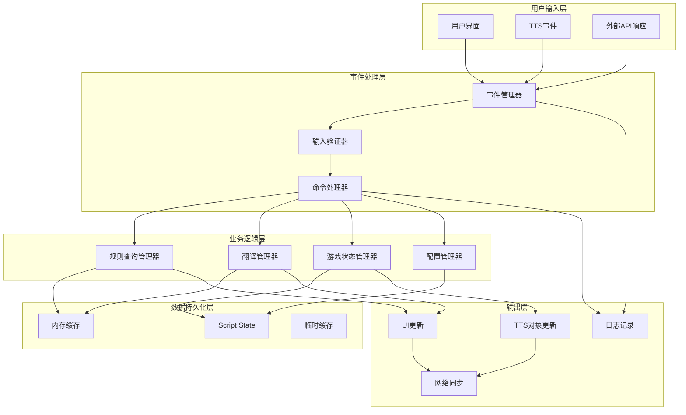
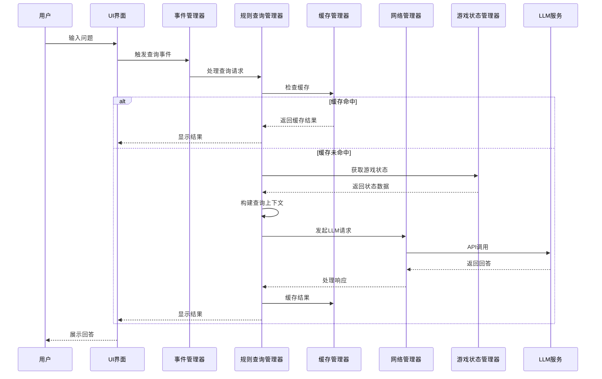
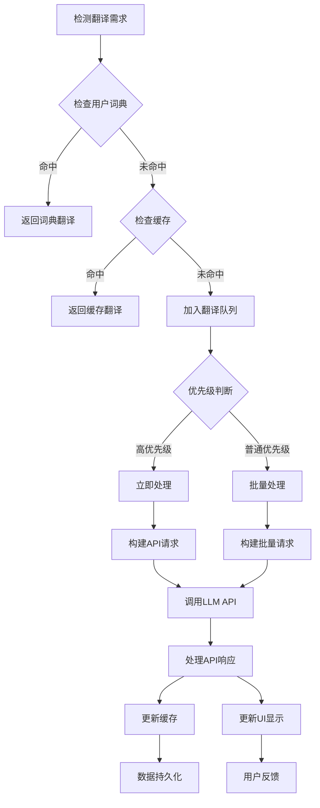
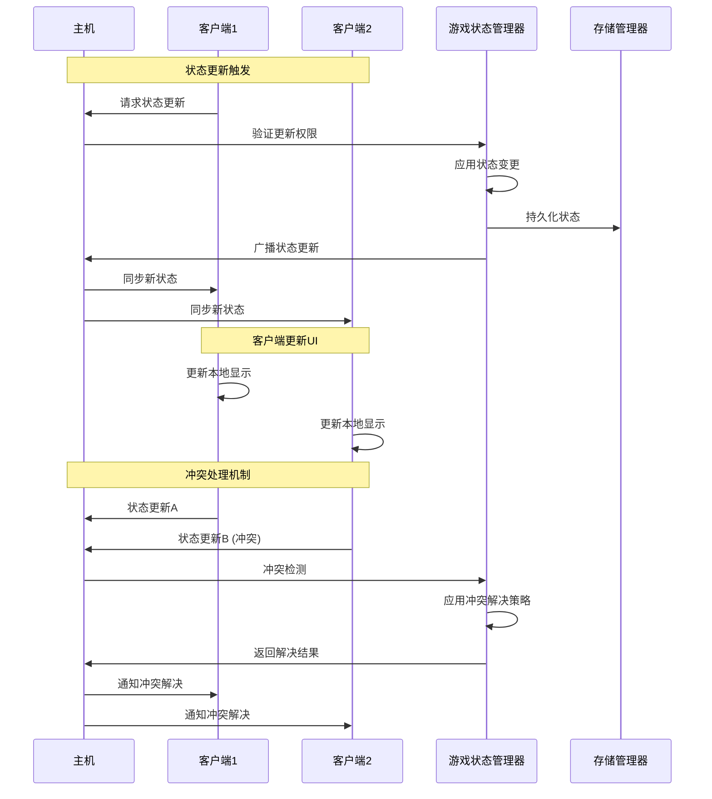
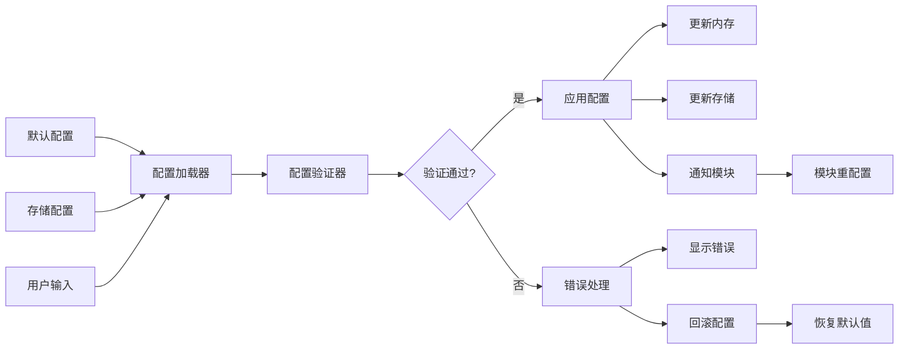

# 桌游伴侣数据流设计文档

> **项目**: 桌游伴侣 (Tabletop Companion)  
> **架构师**: SystemArchitectAI (维克托)  
> **设计时间**: 2025-01-27  
> **文档版本**: 1.0  
> **依赖**: SYSTEM_ARCHITECTURE.md, MODULE_DESIGN.md

## 📊 数据流总览

桌游伴侣的数据流设计基于**事件驱动架构**和**单向数据流**原则，确保数据的一致性和可追踪性。

### 核心数据流模式



## 🔄 主要数据流详解

### 1. 规则查询数据流

规则查询是系统的核心功能，涉及复杂的数据流转：



#### 数据结构定义

```lua
-- 规则查询数据流中的关键数据结构
local QueryDataFlow = {
    -- 输入数据
    input = {
        question = "",          -- 用户问题
        context_options = {},   -- 上下文选项
        player_id = "",         -- 查询玩家ID
        timestamp = 0           -- 查询时间戳
    },
    
    -- 处理过程数据
    processing = {
        query_id = "",          -- 唯一查询ID
        cache_key = "",         -- 缓存键
        context_data = {},      -- 构建的上下文
        api_request = {},       -- LLM API请求
        processing_time = 0     -- 处理时间
    },
    
    -- 输出数据
    output = {
        answer = "",            -- LLM回答
        confidence = 0,         -- 置信度
        sources = {},           -- 信息来源
        cached = false,         -- 是否来自缓存
        tokens_used = 0         -- 使用的token数
    }
}
```

### 2. 翻译服务数据流

翻译服务采用批量处理和优先级队列机制：



#### 翻译队列管理

```lua
-- 翻译队列数据结构
local TranslationQueue = {
    -- 队列配置
    config = {
        max_batch_size = 5,
        process_interval = 2000, -- 2秒
        priority_levels = {"low", "normal", "high", "urgent"}
    },
    
    -- 队列状态
    queues = {
        urgent = {},    -- 紧急队列（立即处理）
        high = {},      -- 高优先级队列
        normal = {},    -- 普通队列
        low = {}        -- 低优先级队列
    },
    
    -- 活跃任务
    active_tasks = {},
    
    -- 统计数据
    stats = {
        total_queued = 0,
        total_processed = 0,
        average_wait_time = 0,
        batch_efficiency = 0
    }
}

function TranslationQueue:enqueue(translation_task)
    local priority = translation_task.priority or "normal"
    table.insert(self.queues[priority], translation_task)
    
    self.stats.total_queued = self.stats.total_queued + 1
    
    -- 如果是紧急任务，立即处理
    if priority == "urgent" then
        self:processImmediately(translation_task)
    elseif priority == "high" then
        -- 高优先级任务在下一个处理周期优先处理
        self:scheduleNextProcess()
    end
end

function TranslationQueue:processNext()
    -- 按优先级顺序处理
    for _, priority in ipairs(self.config.priority_levels) do
        if #self.queues[priority] > 0 then
            local batch = self:extractBatch(priority)
            if #batch > 0 then
                self:processBatch(batch)
                break
            end
        end
    end
end
```

### 3. 游戏状态同步数据流

游戏状态管理涉及多客户端同步和冲突解决：



#### 状态同步机制

```lua
-- 游戏状态同步数据结构
local StateSyncManager = {
    -- 同步配置
    sync_config = {
        sync_interval = 1000,    -- 1秒同步间隔
        conflict_resolution = "last_write_wins", -- 冲突解决策略
        max_history_size = 50    -- 最大历史记录
    },
    
    -- 状态版本控制
    version_control = {
        current_version = 0,
        version_history = {},
        pending_updates = {}
    },
    
    -- 客户端状态跟踪
    client_states = {},
    
    -- 冲突检测
    conflict_detector = {}
}

function StateSyncManager:updateState(state_change, source_client)
    -- 生成新版本号
    local new_version = self.version_control.current_version + 1
    
    -- 冲突检测
    local conflict = self:detectConflict(state_change, new_version)
    
    if conflict then
        -- 应用冲突解决策略
        state_change = self:resolveConflict(conflict, state_change)
    end
    
    -- 应用状态变更
    local updated_state = self:applyStateChange(state_change)
    
    -- 更新版本信息
    self.version_control.current_version = new_version
    self:recordStateHistory(updated_state, new_version)
    
    -- 广播更新
    self:broadcastStateUpdate(updated_state, new_version, source_client)
    
    return updated_state
end

function StateSyncManager:detectConflict(state_change, version)
    -- 检查是否有其他客户端的并发修改
    for client_id, client_state in pairs(self.client_states) do
        if client_state.last_update_version > state_change.base_version then
            return {
                type = "concurrent_modification",
                conflicting_client = client_id,
                conflicting_change = client_state.last_change
            }
        end
    end
    
    return nil
end
```

### 4. 配置数据流

配置管理涉及默认值、用户自定义和运行时更新：



#### 配置更新数据流

```lua
-- 配置更新数据流处理
local ConfigUpdateFlow = {
    -- 更新步骤
    steps = {
        "validate_input",
        "backup_current",
        "apply_changes",
        "notify_modules",
        "persist_changes",
        "confirm_success"
    },
    
    -- 回滚机制
    rollback_data = {},
    
    -- 更新监听器
    update_listeners = {}
}

function ConfigUpdateFlow:processUpdate(config_path, new_value, options)
    local update_context = {
        path = config_path,
        new_value = new_value,
        old_value = nil,
        timestamp = os.time(),
        rollback_data = {},
        options = options or {}
    }
    
    -- 执行更新步骤
    for _, step in ipairs(self.steps) do
        local success, error_msg = self:executeStep(step, update_context)
        
        if not success then
            -- 执行回滚
            self:rollback(update_context, step)
            return false, error_msg
        end
    end
    
    return true, "配置更新成功"
end

function ConfigUpdateFlow:executeStep(step, context)
    local step_handlers = {
        validate_input = function(ctx)
            return ConfigValidator:validate(ctx.path, ctx.new_value)
        end,
        
        backup_current = function(ctx)
            ctx.old_value = ConfigManager:get(ctx.path)
            ctx.rollback_data.previous_value = ctx.old_value
            return true
        end,
        
        apply_changes = function(ctx)
            return ConfigManager:setInternal(ctx.path, ctx.new_value)
        end,
        
        notify_modules = function(ctx)
            self:notifyUpdateListeners(ctx.path, ctx.new_value, ctx.old_value)
            return true
        end,
        
        persist_changes = function(ctx)
            return StorageManager:set("config", ConfigManager:getAllConfig())
        end,
        
        confirm_success = function(ctx)
            Logger:log("INFO", "配置更新完成", {
                path = ctx.path,
                old_value = ctx.old_value,
                new_value = ctx.new_value
            })
            return true
        end
    }
    
    local handler = step_handlers[step]
    if handler then
        return handler(context)
    else
        return false, "未知的更新步骤: " .. step
    end
end
```

## 📡 事件驱动架构

### 事件类型定义

```lua
-- 系统事件类型定义
local EventTypes = {
    -- UI事件
    UI_BUTTON_CLICK = "ui.button.click",
    UI_INPUT_CHANGE = "ui.input.change",
    UI_PANEL_SHOW = "ui.panel.show",
    UI_PANEL_HIDE = "ui.panel.hide",
    
    -- 游戏状态事件
    GAME_STATE_UPDATE = "game.state.update",
    PLAYER_JOIN = "game.player.join",
    PLAYER_LEAVE = "game.player.leave",
    SCORE_UPDATE = "game.score.update",
    TURN_CHANGE = "game.turn.change",
    
    -- 翻译事件
    TRANSLATION_REQUEST = "translation.request",
    TRANSLATION_COMPLETE = "translation.complete",
    TRANSLATION_ERROR = "translation.error",
    
    -- 规则查询事件
    RULE_QUERY_START = "rule.query.start",
    RULE_QUERY_COMPLETE = "rule.query.complete",
    RULE_QUERY_ERROR = "rule.query.error",
    
    -- 网络事件
    NETWORK_REQUEST = "network.request",
    NETWORK_RESPONSE = "network.response",
    NETWORK_ERROR = "network.error",
    
    -- 配置事件
    CONFIG_UPDATE = "config.update",
    CONFIG_RESET = "config.reset",
    
    -- 系统事件
    SYSTEM_INIT = "system.init",
    SYSTEM_READY = "system.ready",
    SYSTEM_ERROR = "system.error",
    SYSTEM_SHUTDOWN = "system.shutdown"
}
```

### 事件管理器实现

```lua
-- 事件管理器
local EventManager = {
    -- 事件监听器
    listeners = {},
    
    -- 事件队列
    event_queue = {},
    
    -- 处理状态
    processing = false,
    
    -- 统计数据
    stats = {
        total_events = 0,
        processed_events = 0,
        failed_events = 0,
        average_processing_time = 0
    }
}

function EventManager:addEventListener(event_type, listener_id, callback, options)
    options = options or {}
    
    if not self.listeners[event_type] then
        self.listeners[event_type] = {}
    end
    
    self.listeners[event_type][listener_id] = {
        callback = callback,
        priority = options.priority or 5, -- 1-10, 10为最高优先级
        once = options.once or false,      -- 是否只执行一次
        async = options.async or false     -- 是否异步执行
    }
    
    Logger:log("DEBUG", "事件监听器注册", {
        event_type = event_type,
        listener_id = listener_id,
        priority = options.priority
    })
end

function EventManager:removeEventListener(event_type, listener_id)
    if self.listeners[event_type] then
        self.listeners[event_type][listener_id] = nil
    end
end

function EventManager:emitEvent(event_type, event_data, options)
    options = options or {}
    
    local event = {
        type = event_type,
        data = event_data or {},
        timestamp = os.time(),
        id = self:generateEventId(),
        source = options.source or "unknown",
        sync = options.sync ~= false -- 默认同步处理
    }
    
    self.stats.total_events = self.stats.total_events + 1
    
    if event.sync then
        -- 同步处理
        self:processEvent(event)
    else
        -- 异步处理，加入队列
        table.insert(self.event_queue, event)
        self:scheduleProcessing()
    end
    
    return event.id
end

function EventManager:processEvent(event)
    local start_time = os.clock()
    local listeners = self.listeners[event.type]
    
    if not listeners then
        return
    end
    
    -- 按优先级排序监听器
    local sorted_listeners = {}
    for listener_id, listener in pairs(listeners) do
        table.insert(sorted_listeners, {
            id = listener_id,
            listener = listener
        })
    end
    
    table.sort(sorted_listeners, function(a, b)
        return a.listener.priority > b.listener.priority
    end)
    
    -- 执行监听器
    for _, entry in ipairs(sorted_listeners) do
        local listener_id = entry.id
        local listener = entry.listener
        
        local success, result = pcall(listener.callback, event)
        
        if not success then
            self.stats.failed_events = self.stats.failed_events + 1
            ErrorHandler:handle("EVENT_LISTENER_ERROR", "事件监听器执行失败", {
                event_type = event.type,
                listener_id = listener_id,
                error = result
            })
        end
        
        -- 如果是一次性监听器，移除它
        if listener.once then
            self.listeners[event.type][listener_id] = nil
        end
    end
    
    -- 更新统计
    self.stats.processed_events = self.stats.processed_events + 1
    local processing_time = (os.clock() - start_time) * 1000
    self.stats.average_processing_time = 
        (self.stats.average_processing_time * (self.stats.processed_events - 1) + processing_time) 
        / self.stats.processed_events
end
```

## 💾 数据持久化策略

### 分层存储策略

```lua
-- 数据持久化分层管理
local PersistenceStrategy = {
    -- 存储层级定义
    storage_layers = {
        -- 第1层：热数据（内存）
        hot = {
            storage_type = "memory",
            access_pattern = "frequent",
            data_types = {"ui_state", "active_sessions", "temp_cache"},
            ttl = 300, -- 5分钟
            max_size = 1024 * 1024 -- 1MB
        },
        
        -- 第2层：温数据（script_state）
        warm = {
            storage_type = "script_state",
            access_pattern = "regular",
            data_types = {"user_config", "game_state", "small_cache"},
            ttl = 3600, -- 1小时
            max_size = 50 * 1024 -- 50KB
        },
        
        -- 第3层：冷数据（压缩存储）
        cold = {
            storage_type = "compressed_script_state",
            access_pattern = "infrequent",
            data_types = {"large_cache", "history_data", "backup_data"},
            ttl = 86400, -- 24小时
            compression_ratio = 0.3
        }
    },
    
    -- 数据迁移策略
    migration_rules = {
        -- 热数据到温数据
        hot_to_warm = {
            trigger = "time_based", -- 基于时间
            threshold = 300,        -- 5分钟未访问
            conditions = {"size_limit", "access_frequency"}
        },
        
        -- 温数据到冷数据
        warm_to_cold = {
            trigger = "size_based",  -- 基于大小
            threshold = 0.8,         -- 80%容量
            conditions = {"data_age", "access_pattern"}
        }
    }
}

function PersistenceStrategy:getOptimalStorage(data_key, data_size, access_pattern)
    -- 根据数据特征选择最优存储层级
    
    if access_pattern == "very_frequent" or data_size < 1024 then
        return "hot"
    elseif access_pattern == "frequent" or data_size < 10240 then
        return "warm"
    else
        return "cold"
    end
end

function PersistenceStrategy:migrateData()
    -- 定期数据迁移
    
    -- 检查热数据迁移
    for key, data in pairs(MemoryCache:getAll()) do
        local last_access = data.last_access_time
        local age = os.time() - last_access
        
        if age > self.migration_rules.hot_to_warm.threshold then
            self:moveToWarmStorage(key, data)
            MemoryCache:remove(key)
        end
    end
    
    -- 检查温数据迁移
    local warm_usage = StorageManager:getUsageRatio()
    if warm_usage > self.migration_rules.warm_to_cold.threshold then
        self:migrateLeastUsedToCold()
    end
end
```

### 缓存失效策略

```lua
-- 智能缓存失效管理
local CacheInvalidationManager = {
    -- 失效策略
    invalidation_strategies = {
        -- 基于时间的失效
        time_based = {
            enabled = true,
            default_ttl = 3600,  -- 1小时
            max_ttl = 86400      -- 24小时
        },
        
        -- 基于依赖的失效
        dependency_based = {
            enabled = true,
            dependency_graph = {},
            cascade_invalidation = true
        },
        
        -- 基于版本的失效
        version_based = {
            enabled = true,
            version_tracking = {},
            auto_increment = true
        },
        
        -- 基于容量的失效（LRU）
        capacity_based = {
            enabled = true,
            max_entries = 1000,
            eviction_policy = "lru"
        }
    },
    
    -- 失效监听器
    invalidation_listeners = {}
}

function CacheInvalidationManager:invalidateCache(cache_key, reason)
    local invalidation_info = {
        key = cache_key,
        reason = reason,
        timestamp = os.time(),
        cascade_keys = {}
    }
    
    -- 直接失效目标缓存
    CacheManager:remove(cache_key)
    
    -- 处理级联失效
    if self.invalidation_strategies.dependency_based.cascade_invalidation then
        local dependent_keys = self:getDependentKeys(cache_key)
        for _, dependent_key in ipairs(dependent_keys) do
            self:invalidateCache(dependent_key, "dependency")
            table.insert(invalidation_info.cascade_keys, dependent_key)
        end
    end
    
    -- 通知失效监听器
    self:notifyInvalidationListeners(invalidation_info)
    
    Logger:log("DEBUG", "缓存失效", invalidation_info)
end

function CacheInvalidationManager:setupDependency(cache_key, depends_on)
    -- 建立缓存依赖关系
    
    if not self.invalidation_strategies.dependency_based.dependency_graph[depends_on] then
        self.invalidation_strategies.dependency_based.dependency_graph[depends_on] = {}
    end
    
    table.insert(
        self.invalidation_strategies.dependency_based.dependency_graph[depends_on],
        cache_key
    )
end
```

## 🔄 数据一致性保证

### 事务性操作

```lua
-- 事务管理器（简化版）
local TransactionManager = {
    -- 活跃事务
    active_transactions = {},
    
    -- 事务日志
    transaction_log = {},
    
    -- 锁管理
    locks = {}
}

function TransactionManager:beginTransaction(transaction_id)
    local transaction = {
        id = transaction_id or self:generateTransactionId(),
        start_time = os.time(),
        operations = {},
        rollback_data = {},
        status = "active"
    }
    
    self.active_transactions[transaction.id] = transaction
    
    return transaction.id
end

function TransactionManager:addOperation(transaction_id, operation)
    local transaction = self.active_transactions[transaction_id]
    if not transaction then
        return false, "事务不存在"
    end
    
    -- 记录回滚数据
    if operation.type == "update" then
        operation.rollback_data = {
            key = operation.key,
            old_value = StorageManager:get(operation.key)
        }
    end
    
    table.insert(transaction.operations, operation)
    return true
end

function TransactionManager:commitTransaction(transaction_id)
    local transaction = self.active_transactions[transaction_id]
    if not transaction then
        return false, "事务不存在"
    end
    
    -- 执行所有操作
    for _, operation in ipairs(transaction.operations) do
        local success = self:executeOperation(operation)
        if not success then
            -- 如果操作失败，回滚整个事务
            self:rollbackTransaction(transaction_id)
            return false, "事务执行失败，已回滚"
        end
    end
    
    -- 提交成功，清理事务
    transaction.status = "committed"
    transaction.end_time = os.time()
    
    self:logTransaction(transaction)
    self.active_transactions[transaction_id] = nil
    
    return true
end

function TransactionManager:rollbackTransaction(transaction_id)
    local transaction = self.active_transactions[transaction_id]
    if not transaction then
        return false, "事务不存在"
    end
    
    -- 反向执行回滚操作
    for i = #transaction.operations, 1, -1 do
        local operation = transaction.operations[i]
        if operation.rollback_data then
            self:executeRollback(operation.rollback_data)
        end
    end
    
    transaction.status = "rolled_back"
    transaction.end_time = os.time()
    
    self:logTransaction(transaction)
    self.active_transactions[transaction_id] = nil
    
    return true
end
```

---

## 📈 性能监控与优化

### 数据流性能监控

```lua
-- 性能监控器
local PerformanceMonitor = {
    -- 监控指标
    metrics = {
        data_flow_latency = {},      -- 数据流延迟
        cache_hit_rate = {},         -- 缓存命中率
        storage_access_time = {},    -- 存储访问时间
        event_processing_time = {},  -- 事件处理时间
        memory_usage = {},           -- 内存使用量
        api_response_time = {}       -- API响应时间
    },
    
    -- 性能阈值
    thresholds = {
        max_latency = 1000,          -- 最大延迟1秒
        min_cache_hit_rate = 0.8,    -- 最小缓存命中率80%
        max_memory_usage = 10485760, -- 最大内存使用10MB
        max_api_response_time = 5000 -- 最大API响应时间5秒
    },
    
    -- 优化建议
    optimization_suggestions = {}
}

function PerformanceMonitor:recordMetric(metric_name, value, context)
    if not self.metrics[metric_name] then
        self.metrics[metric_name] = {}
    end
    
    local metric_entry = {
        value = value,
        timestamp = os.time(),
        context = context or {}
    }
    
    table.insert(self.metrics[metric_name], metric_entry)
    
    -- 保持最近1000条记录
    if #self.metrics[metric_name] > 1000 then
        table.remove(self.metrics[metric_name], 1)
    end
    
    -- 检查性能阈值
    self:checkThresholds(metric_name, value)
end

function PerformanceMonitor:generateOptimizationSuggestions()
    local suggestions = {}
    
    -- 分析缓存命中率
    local cache_hit_rate = self:calculateAverageCacheHitRate()
    if cache_hit_rate < self.thresholds.min_cache_hit_rate then
        table.insert(suggestions, {
            type = "cache_optimization",
            description = "缓存命中率较低，建议优化缓存策略",
            current_value = cache_hit_rate,
            target_value = self.thresholds.min_cache_hit_rate,
            priority = "high"
        })
    end
    
    -- 分析内存使用
    local avg_memory_usage = self:calculateAverageMemoryUsage()
    if avg_memory_usage > self.thresholds.max_memory_usage * 0.8 then
        table.insert(suggestions, {
            type = "memory_optimization",
            description = "内存使用量接近上限，建议清理缓存或优化数据结构",
            current_value = avg_memory_usage,
            target_value = self.thresholds.max_memory_usage * 0.6,
            priority = "medium"
        })
    end
    
    return suggestions
end
```

---

**总结**: 数据流设计文档完成，涵盖了系统中所有主要的数据流动模式、事件处理机制、持久化策略和性能优化方案。这为实际开发提供了详细的技术指导。 