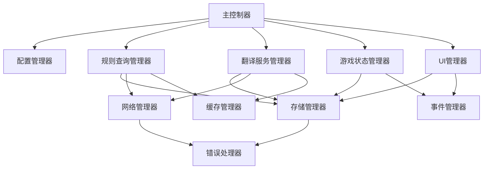

# 桌游伴侣模块设计文档

> **项目**: 桌游伴侣 (Tabletop Companion)  
> **架构师**: SystemArchitectAI (维克托)  
> **设计时间**: 2025-01-27  
> **文档版本**: 1.0  
> **依赖**: SYSTEM_ARCHITECTURE.md

## 📚 模块总览

基于系统架构设计，桌游伴侣采用模块化架构，每个模块具有明确的职责边界和标准化的接口。

### 模块依赖关系



## 🏗️ 核心模块详细设计

### 1. 主控制器 (MainController)

**职责**: 系统初始化、模块协调、生命周期管理

```lua
-- 主控制器模块
local MainController = {
    -- 模块注册表
    modules = {},
    -- 系统状态
    system_state = "INITIALIZING", -- INITIALIZING, READY, ERROR
    -- 配置
    config = {},
    -- 版本信息
    version = "1.0.0"
}

function MainController:initialize()
    -- 初始化序列
    self:loadConfig()
    self:initializeModules()
    self:setupEventHandlers()
    self:createUI()
    self.system_state = "READY"
    Logger:log("INFO", "桌游伴侣初始化完成", {version = self.version})
end

function MainController:registerModule(name, module)
    self.modules[name] = module
    Logger:log("DEBUG", "模块注册", {module = name})
end

function MainController:getModule(name)
    return self.modules[name]
end

function MainController:shutdown()
    -- 安全关闭所有模块
    for name, module in pairs(self.modules) do
        if module.shutdown then
            module:shutdown()
        end
    end
    self.system_state = "SHUTDOWN"
end
```

### 2. 配置管理器 (ConfigManager)

**职责**: 配置数据的加载、保存、验证和访问

```lua
local ConfigManager = {
    -- 默认配置
    default_config = {
        ui = {
            theme = "default",
            position = {x = 100, y = 100},
            size = {width = 400, height = 600},
            auto_hide = false
        },
        llm = {
            api_url = "",
            model = "gpt-3.5-turbo",
            timeout = 30,
            max_tokens = 2000
        },
        translation = {
            target_language = "zh-CN",
            auto_translate = false,
            cache_enabled = true,
            batch_size = 5
        },
        rules = {
            cache_enabled = true,
            context_depth = 3,
            smart_search = true
        }
    },
    
    -- 当前配置
    current_config = {},
    
    -- 配置验证规则
    validation_rules = {}
}

function ConfigManager:initialize()
    -- 加载配置
    self:loadConfig()
    -- 验证配置
    self:validateConfig()
    -- 应用配置
    self:applyConfig()
end

function ConfigManager:loadConfig()
    local stored_config = StorageManager:get("config")
    if stored_config then
        self.current_config = self:mergeConfigs(self.default_config, stored_config)
    else
        self.current_config = self:deepCopy(self.default_config)
    end
end

function ConfigManager:saveConfig()
    return StorageManager:set("config", self.current_config)
end

function ConfigManager:get(key_path)
    return self:getNestedValue(self.current_config, key_path)
end

function ConfigManager:set(key_path, value)
    self:setNestedValue(self.current_config, key_path, value)
    return self:saveConfig()
end

function ConfigManager:validateConfig()
    -- 配置验证逻辑
    local errors = {}
    
    -- UI配置验证
    if self.current_config.ui.position.x < 0 or self.current_config.ui.position.x > 2000 then
        table.insert(errors, "UI位置X坐标超出范围")
    end
    
    -- LLM配置验证
    if self.current_config.llm.timeout < 5 or self.current_config.llm.timeout > 120 then
        table.insert(errors, "LLM超时时间应在5-120秒之间")
    end
    
    if #errors > 0 then
        ErrorHandler:handle("CONFIG_VALIDATION_ERROR", "配置验证失败", {errors = errors})
        return false
    end
    
    return true
end
```

### 3. 规则查询管理器 (RuleQueryManager)

**职责**: 智能规则问答、上下文管理、查询优化

```lua
local RuleQueryManager = {
    -- 查询历史
    query_history = {},
    -- 当前会话上下文
    session_context = {},
    -- 规则文档缓存
    rule_documents = {},
    -- 查询统计
    query_stats = {
        total_queries = 0,
        cache_hits = 0,
        api_calls = 0
    }
}

function RuleQueryManager:initialize()
    self:loadQueryHistory()
    self:setupQueryHandlers()
end

function RuleQueryManager:queryRule(question, options)
    options = options or {}
    
    -- 查询参数
    local query_params = {
        question = question,
        include_context = options.include_context ~= false,
        use_cache = options.use_cache ~= false,
        context_depth = options.context_depth or 3
    }
    
    -- 更新统计
    self.query_stats.total_queries = self.query_stats.total_queries + 1
    
    -- 检查缓存
    if query_params.use_cache then
        local cached_result = self:getCachedQuery(question)
        if cached_result then
            self.query_stats.cache_hits = self.query_stats.cache_hits + 1
            return self:formatQueryResult(cached_result, true)
        end
    end
    
    -- 构建查询上下文
    local context = self:buildQueryContext(query_params)
    
    -- 执行LLM查询
    return self:executeLLMQuery(context, function(result)
        -- 缓存结果
        if query_params.use_cache then
            self:cacheQuery(question, result)
        end
        
        -- 更新历史
        self:addToHistory(question, result)
        
        -- 返回格式化结果
        return self:formatQueryResult(result, false)
    end)
end

function RuleQueryManager:buildQueryContext(params)
    local context = {
        question = params.question,
        rule_documents = {},
        game_state = {},
        previous_queries = {},
        timestamp = os.time()
    }
    
    -- 添加规则文档
    if self.rule_documents.current then
        context.rule_documents = self.rule_documents.current
    end
    
    -- 添加游戏状态 (如果可用)
    if params.include_context then
        local game_manager = MainController:getModule("GameStateManager")
        if game_manager then
            context.game_state = game_manager:getCurrentState()
        end
    end
    
    -- 添加相关历史查询
    context.previous_queries = self:getRelevantHistory(params.question, params.context_depth)
    
    return context
end

function RuleQueryManager:executeLLMQuery(context, callback)
    local network_manager = MainController:getModule("NetworkManager")
    
    -- 构建API请求
    local api_request = {
        model = ConfigManager:get("llm.model"),
        messages = self:buildLLMMessages(context),
        max_tokens = ConfigManager:get("llm.max_tokens"),
        temperature = 0.3 -- 规则查询需要准确性
    }
    
    -- 执行API调用
    self.query_stats.api_calls = self.query_stats.api_calls + 1
    
    return network_manager:callLLMAPI("/chat/completions", api_request, function(response)
        if response.error then
            ErrorHandler:handle("LLM_API_ERROR", "LLM查询失败", {
                error = response.error,
                context = context
            })
            return
        end
        
        local result = {
            answer = response.choices[1].message.content,
            confidence = self:calculateConfidence(response),
            sources = self:extractSources(context),
            query_time = os.time(),
            tokens_used = response.usage.total_tokens
        }
        
        if callback then
            callback(result)
        end
    end)
end

function RuleQueryManager:buildLLMMessages(context)
    local messages = {}
    
    -- 系统提示词
    table.insert(messages, {
        role = "system",
        content = self:buildSystemPrompt(context)
    })
    
    -- 规则文档
    if context.rule_documents then
        table.insert(messages, {
            role = "system",
            content = "规则文档:\n" .. context.rule_documents
        })
    end
    
    -- 游戏状态上下文
    if context.game_state and next(context.game_state) then
        table.insert(messages, {
            role = "system",
            content = "当前游戏状态:\n" .. JSON.encode(context.game_state)
        })
    end
    
    -- 相关历史查询
    for _, prev_query in ipairs(context.previous_queries) do
        table.insert(messages, {
            role = "user",
            content = prev_query.question
        })
        table.insert(messages, {
            role = "assistant",
            content = prev_query.answer
        })
    end
    
    -- 当前问题
    table.insert(messages, {
        role = "user",
        content = context.question
    })
    
    return messages
end

function RuleQueryManager:buildSystemPrompt(context)
    return [[
你是一个专业的桌游规则专家和裁判。你的任务是基于提供的规则文档和当前游戏状态，准确回答玩家关于游戏规则的问题。

回答要求：
1. 准确性：严格基于规则文档，不要猜测或添加规则中没有的内容
2. 简洁性：直接回答问题，避免冗余信息
3. 实用性：如果涉及具体操作，提供清晰的步骤指导
4. 上下文相关：结合当前游戏状态给出针对性建议
5. 不确定时：如果规则不明确或文档中没有相关信息，明确说明

如果问题涉及争议性规则解释，提供常见的解释方式并建议玩家协商决定。
]]
end
```

### 4. 翻译服务管理器 (TranslationManager)

**职责**: 游戏内容翻译、缓存管理、术语词典

```lua
local TranslationManager = {
    -- 翻译缓存
    translation_cache = {},
    -- 用户术语词典
    user_dictionary = {},
    -- 翻译统计
    translation_stats = {
        total_translations = 0,
        cache_hits = 0,
        api_calls = 0,
        user_corrections = 0
    },
    -- 翻译队列
    translation_queue = {},
    -- 当前翻译任务
    active_translations = {}
}

function TranslationManager:initialize()
    self:loadCache()
    self:loadUserDictionary()
    self:setupTranslationHandlers()
end

function TranslationManager:translateText(text, options)
    options = options or {}
    
    local translation_params = {
        text = text,
        target_language = options.target_language or ConfigManager:get("translation.target_language"),
        use_cache = options.use_cache ~= false,
        use_dictionary = options.use_dictionary ~= false,
        context = options.context or "",
        priority = options.priority or "normal"
    }
    
    -- 统计更新
    self.translation_stats.total_translations = self.translation_stats.total_translations + 1
    
    -- 检查用户词典
    if translation_params.use_dictionary then
        local dict_result = self:checkUserDictionary(text)
        if dict_result then
            return self:formatTranslationResult(dict_result, "dictionary")
        end
    end
    
    -- 检查缓存
    if translation_params.use_cache then
        local cached_result = self:getCachedTranslation(text, translation_params.target_language)
        if cached_result then
            self.translation_stats.cache_hits = self.translation_stats.cache_hits + 1
            return self:formatTranslationResult(cached_result, "cache")
        end
    end
    
    -- 添加到翻译队列
    return self:queueTranslation(translation_params)
end

function TranslationManager:queueTranslation(params)
    local translation_id = self:generateTranslationId()
    
    local translation_task = {
        id = translation_id,
        params = params,
        status = "queued",
        created_at = os.time(),
        callback = nil
    }
    
    table.insert(self.translation_queue, translation_task)
    
    -- 如果是高优先级，立即处理
    if params.priority == "high" then
        self:processTranslationQueue()
    else
        -- 延迟批量处理
        self:scheduleQueueProcessing()
    end
    
    return translation_id
end

function TranslationManager:processTranslationQueue()
    local batch_size = ConfigManager:get("translation.batch_size")
    local batch = {}
    
    -- 提取批量任务
    for i = 1, math.min(batch_size, #self.translation_queue) do
        local task = table.remove(self.translation_queue, 1)
        task.status = "processing"
        table.insert(batch, task)
        self.active_translations[task.id] = task
    end
    
    if #batch == 0 then
        return
    end
    
    -- 构建批量翻译请求
    local batch_request = self:buildBatchTranslationRequest(batch)
    
    -- 执行API调用
    local network_manager = MainController:getModule("NetworkManager")
    self.translation_stats.api_calls = self.translation_stats.api_calls + 1
    
    network_manager:callLLMAPI("/chat/completions", batch_request, function(response)
        self:processBatchTranslationResponse(batch, response)
    end)
end

function TranslationManager:buildBatchTranslationRequest(batch)
    local texts_to_translate = {}
    local contexts = {}
    
    for _, task in ipairs(batch) do
        table.insert(texts_to_translate, task.params.text)
        table.insert(contexts, task.params.context)
    end
    
    local prompt = self:buildTranslationPrompt(texts_to_translate, contexts, batch[1].params.target_language)
    
    return {
        model = ConfigManager:get("llm.model"),
        messages = {
            {
                role = "system",
                content = prompt.system
            },
            {
                role = "user",
                content = prompt.user
            }
        },
        max_tokens = ConfigManager:get("llm.max_tokens"),
        temperature = 0.3 -- 翻译需要一致性
    }
end

function TranslationManager:buildTranslationPrompt(texts, contexts, target_language)
    local system_prompt = string.format([[
你是一个专业的桌游翻译专家。请将以下游戏内容翻译成%s。

翻译要求：
1. 保持游戏术语的专业性和一致性
2. 考虑游戏背景和上下文
3. 简洁明了，符合游戏界面显示需求
4. 保留原文中的特殊格式和符号
5. 对于专有名词，提供常用译名

返回格式：请按照输入顺序，每行一个翻译结果，不要添加序号或其他标记。
]], target_language)
    
    local user_content = {}
    for i, text in ipairs(texts) do
        local context_info = contexts[i] and contexts[i] ~= "" and (" (上下文: " .. contexts[i] .. ")") or ""
        table.insert(user_content, text .. context_info)
    end
    
    return {
        system = system_prompt,
        user = table.concat(user_content, "\n")
    }
end

function TranslationManager:addToDictionary(original, translation, context)
    local entry = {
        original = original,
        translation = translation,
        context = context or "",
        created_at = os.time(),
        usage_count = 1
    }
    
    self.user_dictionary[original] = entry
    self:saveUserDictionary()
    
    self.translation_stats.user_corrections = self.translation_stats.user_corrections + 1
    
    Logger:log("INFO", "用户添加术语词典", {
        original = original,
        translation = translation
    })
end

function TranslationManager:updateCache()
    return StorageManager:set("translation_cache", self.translation_cache)
end

function TranslationManager:getTranslationStats()
    return {
        total = self.translation_stats.total_translations,
        cache_hit_rate = self.translation_stats.total_translations > 0 and 
                        (self.translation_stats.cache_hits / self.translation_stats.total_translations * 100) or 0,
        api_calls = self.translation_stats.api_calls,
        user_corrections = self.translation_stats.user_corrections,
        cache_size = self:getCacheSize(),
        dictionary_size = self:getDictionarySize()
    }
end
```

### 5. 游戏状态管理器 (GameStateManager)

**职责**: 游戏状态跟踪、计分管理、流程引导

```lua
local GameStateManager = {
    -- 当前游戏状态
    current_state = {
        game_name = "",
        players = {},
        current_phase = "",
        current_player = "",
        scores = {},
        resources = {},
        turn_count = 0,
        game_started = false
    },
    
    -- 状态历史
    state_history = {},
    
    -- 游戏规则配置
    game_rules = {},
    
    -- 状态监听器
    state_listeners = {}
}

function GameStateManager:initialize()
    self:loadGameState()
    self:setupStateMonitoring()
    self:registerEventHandlers()
end

function GameStateManager:getCurrentState()
    return self:deepCopy(self.current_state)
end

function GameStateManager:updateGameState(state_update)
    local previous_state = self:deepCopy(self.current_state)
    
    -- 应用状态更新
    for key, value in pairs(state_update) do
        self.current_state[key] = value
    end
    
    -- 记录状态历史
    table.insert(self.state_history, {
        timestamp = os.time(),
        previous_state = previous_state,
        current_state = self:deepCopy(self.current_state),
        change_type = state_update.change_type or "manual"
    })
    
    -- 限制历史记录数量
    if #self.state_history > 50 then
        table.remove(self.state_history, 1)
    end
    
    -- 触发状态监听器
    self:notifyStateListeners(previous_state, self.current_state)
    
    -- 保存状态
    self:saveGameState()
    
    -- 同步到所有客户端
    self:syncStateToClients()
end

function GameStateManager:addPlayer(player_name, player_color)
    if not player_name or player_name == "" then
        return false, "玩家名称不能为空"
    end
    
    -- 检查玩家是否已存在
    for _, player in ipairs(self.current_state.players) do
        if player.name == player_name then
            return false, "玩家已存在"
        end
    end
    
    local new_player = {
        name = player_name,
        color = player_color or "White",
        joined_at = os.time(),
        active = true
    }
    
    table.insert(self.current_state.players, new_player)
    
    -- 初始化玩家分数
    self.current_state.scores[player_name] = 0
    
    self:updateGameState({
        change_type = "player_joined",
        new_player = new_player
    })
    
    return true, "玩家添加成功"
end

function GameStateManager:updateScore(player_name, score_change, reason)
    if not self.current_state.scores[player_name] then
        return false, "玩家不存在"
    end
    
    local old_score = self.current_state.scores[player_name]
    local new_score = old_score + score_change
    
    self.current_state.scores[player_name] = new_score
    
    self:updateGameState({
        change_type = "score_update",
        player = player_name,
        old_score = old_score,
        new_score = new_score,
        change = score_change,
        reason = reason or "手动调整"
    })
    
    Logger:log("INFO", "玩家分数更新", {
        player = player_name,
        old_score = old_score,
        new_score = new_score,
        change = score_change,
        reason = reason
    })
    
    return true, "分数更新成功"
end

function GameStateManager:nextTurn()
    if #self.current_state.players == 0 then
        return false, "没有玩家"
    end
    
    local current_index = 1
    
    -- 找到当前玩家的索引
    if self.current_state.current_player ~= "" then
        for i, player in ipairs(self.current_state.players) do
            if player.name == self.current_state.current_player then
                current_index = i
                break
            end
        end
    end
    
    -- 切换到下一个玩家
    local next_index = (current_index % #self.current_state.players) + 1
    local next_player = self.current_state.players[next_index]
    
    -- 如果回到第一个玩家，增加回合数
    if next_index == 1 then
        self.current_state.turn_count = self.current_state.turn_count + 1
    end
    
    self.current_state.current_player = next_player.name
    
    self:updateGameState({
        change_type = "turn_change",
        previous_player = self.current_state.current_player,
        current_player = next_player.name,
        turn_count = self.current_state.turn_count
    })
    
    return true, "回合切换成功"
end

function GameStateManager:registerStateListener(listener_id, callback)
    self.state_listeners[listener_id] = callback
end

function GameStateManager:unregisterStateListener(listener_id)
    self.state_listeners[listener_id] = nil
end

function GameStateManager:notifyStateListeners(previous_state, current_state)
    for listener_id, callback in pairs(self.state_listeners) do
        local success, error_msg = pcall(callback, previous_state, current_state)
        if not success then
            Logger:log("ERROR", "状态监听器执行失败", {
                listener_id = listener_id,
                error = error_msg
            })
        end
    end
end

function GameStateManager:syncStateToClients()
    local sync_data = {
        type = "game_state_update",
        state = self.current_state,
        timestamp = os.time()
    }
    
    broadcastToAll("TabletopCompanion_StateSync", JSON.encode(sync_data))
end
```

### 6. 存储管理器 (StorageManager)

**职责**: 数据持久化、缓存管理、数据压缩

```lua
local StorageManager = {
    -- 内存缓存
    memory_cache = {},
    
    -- 数据模式
    data_schema = {
        config = "object",
        translation_cache = "compressed_object",
        rule_cache = "compressed_object",
        user_dictionary = "object",
        game_state = "object",
        ui_preferences = "object"
    },
    
    -- 压缩配置
    compression_config = {
        enabled = true,
        threshold = 1024, -- 超过1KB的数据进行压缩
        algorithm = "simple" -- 简单的字符串压缩
    }
}

function StorageManager:initialize()
    self:loadAllData()
    self:setupPeriodicSave()
end

function StorageManager:get(key)
    -- 首先检查内存缓存
    if self.memory_cache[key] then
        return self.memory_cache[key]
    end
    
    -- 从script_state加载
    local data = self:loadFromScriptState(key)
    
    if data then
        -- 缓存到内存
        self.memory_cache[key] = data
    end
    
    return data
end

function StorageManager:set(key, value)
    -- 更新内存缓存
    self.memory_cache[key] = value
    
    -- 保存到script_state
    return self:saveToScriptState(key, value)
end

function StorageManager:loadFromScriptState(key)
    local script_state = Global.script_state
    
    if not script_state or script_state == "" then
        return nil
    end
    
    local success, data = pcall(JSON.decode, script_state)
    if not success then
        ErrorHandler:handle("STORAGE_DECODE_ERROR", "script_state解析失败", {
            script_state = script_state,
            error = data
        })
        return nil
    end
    
    local stored_value = data[key]
    if not stored_value then
        return nil
    end
    
    -- 检查是否需要解压缩
    if self.data_schema[key] == "compressed_object" and stored_value.compressed then
        return self:decompress(stored_value.data)
    end
    
    return stored_value
end

function StorageManager:saveToScriptState(key, value)
    local script_state = Global.script_state
    local data = {}
    
    -- 加载现有数据
    if script_state and script_state ~= "" then
        local success, existing_data = pcall(JSON.decode, script_state)
        if success then
            data = existing_data
        end
    end
    
    -- 检查是否需要压缩
    local stored_value = value
    if self.data_schema[key] == "compressed_object" then
        local serialized = JSON.encode(value)
        if #serialized > self.compression_config.threshold then
            stored_value = {
                compressed = true,
                data = self:compress(serialized),
                original_size = #serialized
            }
        end
    end
    
    -- 更新数据
    data[key] = stored_value
    data.last_updated = os.time()
    data.version = "1.0"
    
    -- 保存到script_state
    local success, serialized = pcall(JSON.encode, data)
    if not success then
        ErrorHandler:handle("STORAGE_ENCODE_ERROR", "数据序列化失败", {
            key = key,
            error = serialized
        })
        return false
    end
    
    Global.script_state = serialized
    
    Logger:log("DEBUG", "数据保存成功", {
        key = key,
        size = #serialized,
        compressed = stored_value.compressed or false
    })
    
    return true
end

function StorageManager:compress(data)
    -- 简单的字符串压缩实现
    -- 实际项目中可能需要更复杂的压缩算法
    
    if not self.compression_config.enabled then
        return data
    end
    
    -- 简单的重复字符压缩
    local compressed = data:gsub('(.)\1\1+', function(char)
        local count = 0
        local start_pos = 1
        while data:sub(start_pos, start_pos) == char do
            count = count + 1
            start_pos = start_pos + 1
        end
        if count >= 3 then
            return char .. "[" .. count .. "]"
        else
            return string.rep(char, count)
        end
    end)
    
    return compressed
end

function StorageManager:decompress(compressed_data)
    if not compressed_data then
        return nil
    end
    
    -- 解压缩
    local decompressed = compressed_data:gsub('(.)\[(%d+)\]', function(char, count)
        return string.rep(char, tonumber(count))
    end)
    
    -- 解析JSON
    local success, data = pcall(JSON.decode, decompressed)
    if not success then
        ErrorHandler:handle("STORAGE_DECOMPRESS_ERROR", "数据解压缩失败", {
            error = data
        })
        return nil
    end
    
    return data
end

function StorageManager:clearCache()
    self.memory_cache = {}
    Logger:log("INFO", "内存缓存已清空")
end

function StorageManager:getStorageStats()
    local script_state_size = #(Global.script_state or "")
    local memory_cache_size = 0
    local cached_keys = 0
    
    for key, value in pairs(self.memory_cache) do
        cached_keys = cached_keys + 1
        local serialized = JSON.encode(value)
        memory_cache_size = memory_cache_size + #serialized
    end
    
    return {
        script_state_size = script_state_size,
        memory_cache_size = memory_cache_size,
        cached_keys = cached_keys,
        compression_enabled = self.compression_config.enabled
    }
end
```

## 🔗 模块接口标准

### 通用接口规范

所有模块都应实现以下标准接口：

```lua
-- 模块基类
local ModuleBase = {
    name = "",
    version = "1.0",
    dependencies = {},
    status = "UNINITIALIZED" -- UNINITIALIZED, INITIALIZING, READY, ERROR
}

function ModuleBase:initialize()
    -- 模块初始化逻辑
    self.status = "INITIALIZING"
    
    -- 检查依赖
    if not self:checkDependencies() then
        self.status = "ERROR"
        return false
    end
    
    -- 执行具体初始化
    local success = self:onInitialize()
    
    if success then
        self.status = "READY"
    else
        self.status = "ERROR"
    end
    
    return success
end

function ModuleBase:shutdown()
    -- 模块关闭逻辑
    self:onShutdown()
    self.status = "SHUTDOWN"
end

function ModuleBase:getStatus()
    return self.status
end

function ModuleBase:checkDependencies()
    for _, dependency in ipairs(self.dependencies) do
        local module = MainController:getModule(dependency)
        if not module or module:getStatus() ~= "READY" then
            Logger:log("ERROR", "模块依赖未满足", {
                module = self.name,
                missing_dependency = dependency
            })
            return false
        end
    end
    return true
end

-- 子类需要实现的方法
function ModuleBase:onInitialize()
    -- 子类具体初始化逻辑
    return true
end

function ModuleBase:onShutdown()
    -- 子类具体关闭逻辑
end
```

### 错误处理接口

```lua
-- 错误处理接口
local ErrorHandler = {
    error_levels = {
        DEBUG = 0,
        INFO = 1,
        WARNING = 2,
        ERROR = 3,
        FATAL = 4
    },
    
    error_handlers = {}
}

function ErrorHandler:handle(error_code, message, context)
    local error_info = {
        code = error_code,
        message = message,
        context = context or {},
        timestamp = os.time(),
        stack_trace = debug.traceback()
    }
    
    -- 记录错误
    Logger:log("ERROR", message, error_info)
    
    -- 执行错误处理器
    local handler = self.error_handlers[error_code]
    if handler then
        handler(error_info)
    else
        self:defaultErrorHandler(error_info)
    end
end

function ErrorHandler:registerHandler(error_code, handler)
    self.error_handlers[error_code] = handler
end

function ErrorHandler:defaultErrorHandler(error_info)
    -- 默认错误处理：显示用户友好的错误消息
    local user_message = self:getUserFriendlyMessage(error_info.code)
    
    -- 显示错误UI
    local ui_manager = MainController:getModule("UIManager")
    if ui_manager then
        ui_manager:showError(user_message, error_info)
    end
end
```

---

**下一步**: 创建数据流设计文档，详细描述系统中的数据流动和状态管理机制。 