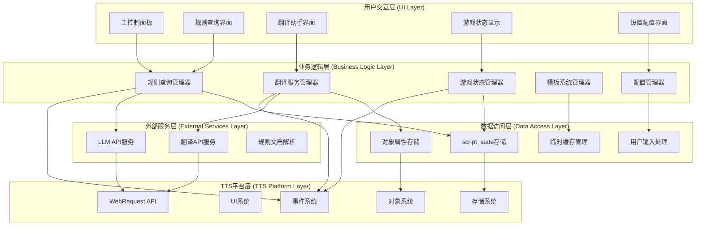
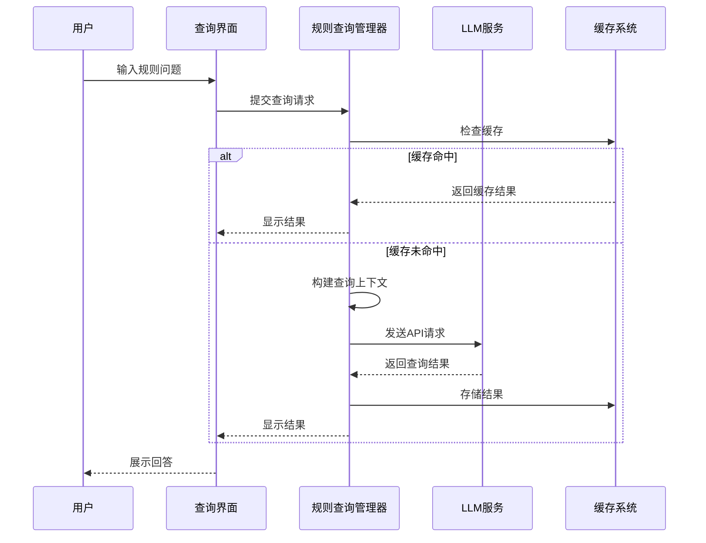
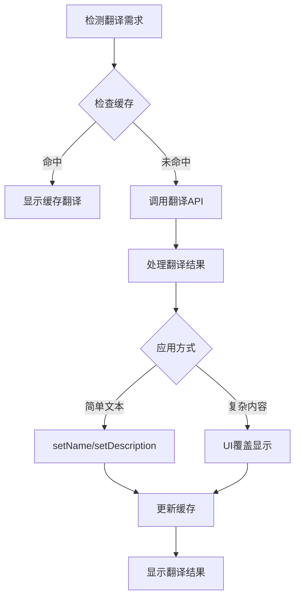

# 桌游伴侣系统架构设计

> **项目**: 桌游伴侣 (Tabletop Companion)  
> **架构师**: SystemArchitectAI (维克托)  
> **设计时间**: 2025-01-27  
> **文档版本**: 1.0  
> **基于**: TTS_API_RESEARCH.md技术可行性验证

## 📋 架构概览

### 核心设计理念

桌游伴侣采用**约束驱动架构**，严格基于TTS Modding API的技术限制进行设计，确保所有功能都能在TTS沙箱环境中稳定运行。

**关键设计原则**:
- **技术约束优先**: 所有设计决策基于TTS API的实际能力
- **模块化设计**: 高内聚、低耦合的模块划分
- **数据轻量化**: 基于script_state的轻量级持久化策略
- **用户体验优先**: 简化用户操作，自动化复杂流程

### 整体架构模式



## 🏛️ 层次架构详解

### 1. 用户交互层 (UI Layer)

基于TTS的XML UI系统，提供模块化的用户界面：

#### 主控制面板
- **功能**: 中央控制台，整合所有功能入口
- **技术**: XML布局 + Lua事件处理
- **特性**: 可折叠、响应式设计、状态指示

#### 规则查询界面
- **功能**: 智能规则问答、上下文查询
- **技术**: 输入框 + 响应显示区域
- **特性**: 历史记录、快速查询按钮

#### 翻译助手界面
- **功能**: 游戏内容翻译、术语管理
- **技术**: 对象UI覆盖 + 全局翻译面板
- **特性**: 实时翻译、缓存显示、手动编辑

### 2. 业务逻辑层 (Business Logic Layer)

核心功能模块，处理所有业务逻辑：

#### 规则查询管理器
```lua
-- 核心功能模块示例
RuleQueryManager = {
    -- 查询历史缓存
    query_history = {},
    -- 当前游戏上下文
    game_context = {},
    -- LLM配置
    llm_config = {}
}

function RuleQueryManager:queryRule(question, context)
    -- 构建查询上下文
    local full_context = self:buildContext(question, context)
    
    -- 调用LLM API
    self:callLLMAPI(full_context, function(response)
        -- 处理响应并更新UI
        self:handleResponse(response)
        -- 缓存查询结果
        self:cacheQuery(question, response)
    end)
end
```

#### 翻译服务管理器
- **责任**: 管理游戏内容翻译、缓存策略
- **接口**: translateObject(), batchTranslate(), manageCache()
- **特性**: 智能缓存、增量翻译、用户词典

#### 游戏状态管理器
- **责任**: 跟踪游戏状态、管理计分、流程引导
- **接口**: updateGameState(), calculateScore(), guideFlow()
- **特性**: 实时更新、状态持久化、事件响应

### 3. 数据访问层 (Data Access Layer)

基于TTS技术约束的数据管理策略：

#### script_state存储策略
```lua
-- 存储架构设计
local StorageManager = {
    -- 数据分类存储
    config_data = {},      -- 配置数据 (小量)
    cache_data = {},       -- 缓存数据 (中量)
    user_data = {},        -- 用户数据 (小量)
    temp_data = {}         -- 临时数据 (不持久化)
}

function StorageManager:save()
    local data = {
        config = self.config_data,
        cache = self:compressCache(self.cache_data),
        user = self.user_data,
        version = "1.0",
        timestamp = os.time()
    }
    return JSON.encode(data)
end
```

#### 数据分层策略
1. **热数据**: 存储在Lua变量中，快速访问
2. **温数据**: 存储在script_state中，持久化
3. **冷数据**: 需要时由用户输入或外部获取
4. **敏感数据**: 用户每次启动时输入

## 🔧 核心模块设计

### 智能规则查询系统



### 翻译系统架构



## 🗃️ 数据模型设计

### 持久化数据结构

```lua
-- 主数据结构 (存储在script_state)
local PersistentData = {
    version = "1.0",
    timestamp = 0,
    
    -- 配置数据
    config = {
        llm_api_url = "",
        target_language = "zh-CN",
        auto_translate = false,
        ui_theme = "default"
    },
    
    -- 翻译缓存 (压缩存储)
    translation_cache = {
        -- key: hash(原文+目标语言), value: 翻译结果
    },
    
    -- 规则查询缓存
    rule_cache = {
        -- key: hash(问题+上下文), value: 回答
    },
    
    -- 用户偏好
    user_preferences = {
        ui_position = {x = 100, y = 100},
        panel_size = {width = 400, height = 600},
        favorite_features = {}
    }
}
```

### 运行时数据结构

```lua
-- 运行时数据 (不持久化)
local RuntimeData = {
    -- LLM API配置 (用户每次输入)
    llm_credentials = {
        api_key = "",
        custom_headers = {}
    },
    
    -- 当前游戏状态
    game_state = {
        current_players = {},
        game_phase = "",
        turn_order = {},
        scores = {}
    },
    
    -- UI状态
    ui_state = {
        active_panel = "",
        loading_states = {},
        error_messages = {}
    }
}
```

## 🌐 网络通信架构

### 主机-客户端同步模式

```lua
-- 网络管理器
local NetworkManager = {
    is_host = false,
    pending_requests = {},
    sync_queue = {}
}

-- 主机端API调用
function NetworkManager:hostAPICall(endpoint, data, callback)
    if not self.is_host then
        -- 客户端请求转发给主机
        broadcastToAll("api_request", {
            endpoint = endpoint,
            data = data,
            requestId = generateId()
        })
        return
    end
    
    -- 主机执行实际请求
    WebRequest.custom(endpoint, "POST", true, data, nil, function(response)
        -- 处理响应
        local result = self:processResponse(response)
        
        -- 广播结果给所有客户端
        broadcastToAll("api_response", {
            requestId = requestId,
            result = result
        })
        
        if callback then callback(result) end
    end)
end
```

## 🔐 安全架构设计

### 敏感数据处理策略

1. **API密钥**: 用户每次启动时输入，存储在运行时内存
2. **缓存数据**: 明文存储在script_state，不包含敏感信息
3. **用户数据**: 最小化收集，仅存储必要的偏好设置
4. **网络传输**: 仅传输必要的查询内容，不传输API密钥

### 错误处理架构

```lua
-- 统一错误处理系统
local ErrorHandler = {
    error_codes = {
        NETWORK_ERROR = 1001,
        API_AUTH_ERROR = 1002,
        STORAGE_ERROR = 1003,
        UI_ERROR = 1004
    }
}

function ErrorHandler:handle(error_code, error_message, context)
    -- 记录错误
    self:logError(error_code, error_message, context)
    
    -- 用户友好的错误提示
    local user_message = self:getUserMessage(error_code)
    
    -- 显示错误并提供解决建议
    UI.setValue("errorPanel", user_message)
    UI.show("errorPanel")
    
    -- 自动恢复机制
    self:attemptRecovery(error_code, context)
end
```

## 📈 性能优化架构

### 缓存策略

1. **多级缓存**: 内存缓存 + script_state持久化
2. **智能过期**: 基于使用频率和时间的LRU策略
3. **压缩存储**: 对大型数据进行压缩后存储
4. **延迟加载**: 非关键数据按需加载

### UI性能优化

1. **懒加载UI**: 按需创建UI元素
2. **事件防抖**: 防止频繁的UI更新
3. **异步处理**: 长时间操作异步执行
4. **资源复用**: UI元素和资源的复用机制

## 🔄 扩展性设计

### 模块化插件架构

```lua
-- 插件系统接口
local PluginSystem = {
    registered_plugins = {},
    plugin_hooks = {}
}

function PluginSystem:registerPlugin(plugin_name, plugin_config)
    self.registered_plugins[plugin_name] = plugin_config
    
    -- 注册钩子函数
    for hook_name, hook_func in pairs(plugin_config.hooks) do
        if not self.plugin_hooks[hook_name] then
            self.plugin_hooks[hook_name] = {}
        end
        table.insert(self.plugin_hooks[hook_name], hook_func)
    end
end

function PluginSystem:executeHook(hook_name, data)
    if self.plugin_hooks[hook_name] then
        for _, hook_func in ipairs(self.plugin_hooks[hook_name]) do
            data = hook_func(data) or data
        end
    end
    return data
end
```

### 游戏模板系统架构

为未来的游戏模板功能预留扩展接口：

```lua
-- 模板系统架构 (预留)
local TemplateSystem = {
    loaded_templates = {},
    template_cache = {},
    active_template = nil
}

-- 模板接口定义
local TemplateInterface = {
    -- 必须实现的接口
    initialize = function(template_data) end,
    getGameRules = function() end,
    getUILayout = function() end,
    getGameLogic = function() end,
    
    -- 可选接口
    onGameStart = function() end,
    onGameEnd = function() end,
    onPlayerAction = function(player, action) end
}
```

## 📊 监控与调试架构

### 日志系统

```lua
-- 分级日志系统
local Logger = {
    log_level = "INFO",
    log_buffer = {},
    max_buffer_size = 100
}

function Logger:log(level, message, context)
    local log_entry = {
        timestamp = os.time(),
        level = level,
        message = message,
        context = context
    }
    
    table.insert(self.log_buffer, log_entry)
    
    -- 保持缓冲区大小
    if #self.log_buffer > self.max_buffer_size then
        table.remove(self.log_buffer, 1)
    end
    
    -- 控制台输出 (开发模式)
    if self.should_print(level) then
        print(string.format("[%s] %s: %s", level, os.date(), message))
    end
end
```

## 🎯 部署架构

### TTS Mod部署结构

```
TabletopCompanion.ttslua           # 主脚本文件
├── core/                          # 核心模块
│   ├── config_manager.lua         # 配置管理
│   ├── storage_manager.lua        # 存储管理
│   ├── network_manager.lua        # 网络管理
│   └── error_handler.lua          # 错误处理
├── modules/                       # 功能模块
│   ├── rule_query/               # 规则查询模块
│   ├── translation/              # 翻译模块
│   ├── game_state/              # 游戏状态模块
│   └── ui/                      # UI模块
├── ui/                           # UI定义文件
│   ├── main_panel.xml           # 主面板
│   ├── rule_query.xml           # 规则查询界面
│   └── translation.xml          # 翻译界面
└── assets/                       # 资源文件
    ├── images/                   # 图片资源
    └── sounds/                   # 音效资源
```

---

**下一步**: 基于此系统架构设计，创建详细的模块设计文档和数据流设计文档。 